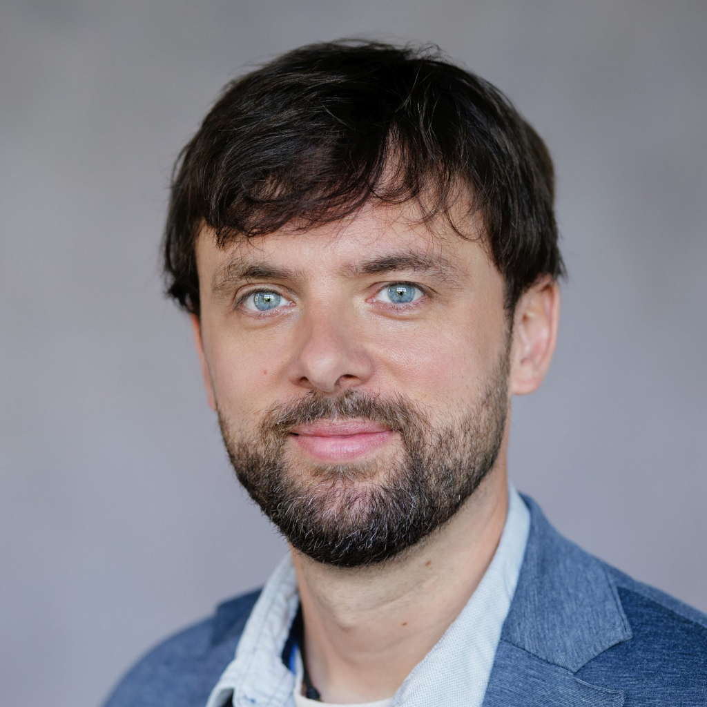

## Personal data

Name
: Benjamin Patrick Jung\

Address / Contact
: Kirchgasse 17\
53347 Alfter\
\
*Phone:* [(+49)1577&nbsp;/&nbsp;159&nbsp;7883](tel:+4915771597883)\
*Email:* <benjamin.jung@outlook.com>\
\

Date/place of birth
: ∗&nbsp;30.08.1982, Karlsruhe\
\

Nationality
: German\
\

Marital status
: married, 3 children\
\

## Professional and project experience

03/2021-today
: **Qvest Digital AG** (formerly tarent solutions GmbH), DevOps Cloud Engineer
  \
  Full stack software development, management of infrastructure as code/configuration in use with a wide range of customers from various industries.

### Projects on behalf of Qvest Digital / tarent

01/2024-11/2024
: **GRS Batterien Service GmbHCloud**
  Platform Engineer / DevOps Engineer\
  \
\
: **Project description:**
  Development and maintenance of the Microsoft Azure-based software platform.
  \
\
: **Tasks:**
  Provisioning and maintenance of the basic infrastructure and setup of the CI/CD pipelines for the deployments of the container-based software components.
  \
\
: **Technologies:**
  Microsoft Azure (esp. Container Apps, Static Web Apps, KeyVault, AppConfiguration, Cognitive Services), Github Workflows
  \
\

12/2023
: **Greenbone AG**
  Trainer/Consultant
  \
\
: **Project description:**
  Hands-on Kubernetes training with subsequent review of a VM-based appliance solution in relation to Kubernetes best practices with a focus on analyzing security and reliability.
  \
\
: **Tasks:**
  Development of a workshop format for a Kubernetes training within the organization, as well as implementation and follow-up of the training with final auditing of a VM-based appliance solution with regard to Kubernetes best practices with a focus on analysis of security and reliability.
  \
\
: **Technologies:**
  Kubernetes, reveal-md
  \
\

11/2022-12/2023
: **REWE digital GmbH**
  Cloud DevOps Engineer / Full Stack Developer
  \
\
: **Project description:**
  Support of a team classified as "Complicated sub-team" in the master data supply of Salesforce.
  \
  Activities included among others:
  * Development of a prototype application based on SAP CAP, which provides data for Salesforce via Salesforce Connect using OData 4.0.
  * Development of a PostgreSQL-based data management system with full-text search, which provides an OpenAPI-based REST interface for Salesforce via a schema-first approach.
  * Maintenance of maintenance and deployment scripts using the Salesforce command line SFDX.
  \
\
: **Tasks:**
  * Software development/maintenance/operation
  * Infrastructure Management (Google Cloud Platform)
  \
\
: **Technologies:**:
  Salesforce, SFDX, Google Cloud Platform (esp. serverless products: Cloud Run, Cloud Function,...), Spring Boot, Kotlin, TypeScript, Kafka, Go, PostgreSQL, OpenAPI v3, sqlc\
  \
\

03/2021-10/2022
: **OC Payment GmbH**
  Full Stack Developer
  \
\
: **Project description:**
  Supporting a start-up in establishing a payment platform in the e-commerce context, specifically for the areas of Merchant Hub and IAM
  \
\
: **Tasks:**
  Setting up/maintaining the basic cloud infrastructure, the associated GitOps-based deployment processes and helping with backend development in creating a data pipeline for processing card payment data.
  \
\
: **Technologies:**
  React, Spring Boot, Google Cloud Platform, Kubernetes, Flux, Git, Java, TypeScript, REST, Github, Spanner DB, Apache Beam, Dataflow
  \
\

01/2010-02/2021
: **ip.labs GmbH** (Bonn)
  Software developer\
  \
  Software development (Java, TypeScript, Go, Scripting), since 2016 in the role of a lead developer with a focus on DevOps engineering and with a strong focus on the support and implementation of (cloud) infrastructure automation with Terraform, Ansible and Kubernetes.
\

2000-2014
: **Terreon, Benjamin and Michael Jung GbR** (Birstein, Hessen)
  Partner\
  \
  IT consulting, software development, user interface design. Together with my brother, I have worked on various freelance projects on behalf of Terreon, some of which are listed below.
\

### Projects as a freelancer / for Terreon

03/2011-11/2012
: **Deutsche Telekom / T-Mobile: B2B Event Processor**
  Maintenance, support and development of the ebXML-based B2B / M2M interface for T-Mobile business customers and sales partners.
  \
\
  Technology stack: JavaEE, EJB3, JBoss EAP, JMS (JBossMQ and JBoss Messaging), Quartz Scheduler, XML, XSLT, JAXB2 and XmlBeans, ClearCase, Git, Apache Maven, …\
\

12/2009-03/2011
: **DB Systel: Project "NEUBAU "**
  Development and customization of Deutsche Bahn's ticket vending machine software Development of a new Java-based user interface based on the existing software libraries\
  \
  Technology stack: C/C++, Boost, RogueWave tools.h++, Java 6, JFC/Swing, Apache SCXML, ZXing, Log4J, JUnit, Ant, SVN, …\
\

08/2009-10/2009
: **VitaSmoke - The smoke-free cigarette**
  Development of the technical concept and implementation of the online store.\
  \
  Technology stack: Python, Django, Satchmo (shopping cart framework), WSGI, MySQL\
\

11/2008-04/2009
: **DB Systel: Accounting systems "B.A.S.S."**
  Development, troubleshooting and maintenance.\
  With the commissioning of B.A.S.S. in March 2009, a Microsoft Access-based legacy system of Deutsche Bahn was replaced.\
  \
  Technology stack: Java EE, EJB, JBoss AS, JPA / Hibernate, Oracle 10g, Jasper Reports, JFC/Swing, Log4J, JUnit, Ant, SVN, …\
\

04/2008-11/2008
: **DB Systel: Integration of the Railteam Broker into the sales and distribution systems of Deutsche Bahn**
  Connection of a SOAP-based interface to the sales systems of Deutsche Bahn and development of a management cockpit for maintenance, monitoring and configuration.\
  \
  Technology stack: Java 5, J2EE 5, Spring, Spring-WS, SOAP, JPA / Hibernate, Oracle 10g, BEA Weblogic, Log4J, JUnit, Apache Wicket, HTML, CSS, JavaScript, Ant, SVN, …\
\

2008
: **regal-systeme.de[(www.regal-systeme.de)](https://www.regal-systeme.de)**
  Development of the technical concept and implementation of the online store.\
  \
  Technology stack: Python, Django, WSGI, MySQL\
\

2007
: **Pyrox Webconf ([webconf.pyrox.eu](https://webconf.pyrox.eu/))**
  Development of specialized software for the web host [Pyrox](https://pyrox.eu/) (The services of PYROX were taken over by [Terreon](https://terreon.de/) in 2012).\
  \
  Conception and development of a fully integrated solution for the administration of hosting customers and the services they use.\
  \
  Technology stack: Debian GNU/Linux, GRSecurity, SELinux, MySQL, PostgreSQL, Postfix, Postgray, Dovecot, Apache HTTPD 2, AWStats, FastCGI, Python 2.5/2.6, PHP5, Java6, C/C++, bash-ScriptsDjango, Python, Markdown\
\

2007
: **My Favourite Present (MFP) 2.0 ([my-mfp.de](https://my-mfp.de/))**
  Re-design of an existing software solution to map a new business logic.
  Development of the technical concept and the software.\
  \
  Technology stack: Python, Django, WSGI, PostgreSQL, Lighttpd\
\

2003-2004
: **"SensorShriek "**
  Development of software for data acquisition.\
\

  

## Presentations and publications

10/2018
: **JCON 2018 in the UCI Kinowelt Düsseldorf**
\
Lecture on the topic "AWS Fargate: Containerization meets Serverless"

\

## Education

2007-2009
: **Distance learning university in Hagen**
  \
  Computer Science, Bachelor of Computer Science: without degree.\
\

2005-2007
: **Technical University (TU)** (Darmstadt)
  \
  Computer Science, Bachelor of Computer Science: no degree.\
\

1994-2002
: **Augustiner Schule, Gymnasium** (Friedberg, Hessen)
  \
  Degree: Abitur\
\

2002-2003
: **DRK Rettungsdienst Mittelhessen gGmbH**
  \
  As a community service volunteer: training as a paramedic\
\

## Certifications

2019
: **Certified Kubernetes Administrator (CKA)**
  \
  Certificate ID Number: [CKA-1900-004101-0100](https://www.youracclaim.com/badges/90eee5df-2ea9-436e-876b571da8bf7781/public_url)\
\

## Languages

German
: mother tongue\
\

English
: business fluent / C1\
\

## Other certifications

Amateur radio license
: **Class E (German)** (callsign: DO2EX)\
\

<!--
Führerschein
: **Euro Class A and B** (since 2000)\
\
-->

## Extract of current knowledge and technology focus

Operating systems
: Linux-based distributions (since 1994, e.g. Ubuntu, Red Hat, SuSE, Fedora,…), macOS, Windows, various BSD derivatives,…\
\

Languages
: Java, Go, C, C++, JavaScript/TypeScript, shell scripting (bash/zsh),…\
\

Platform automation &amp; tools
: Kubernetes, Rancher, Docker, Terraform, bicep, Pulumi, CoreDNS, etcd, Prometheus, HashiCorp Vault, PostgreSQL, Jenkins CI, Concourse CI, SonarQube, Github Workflows, GitLab, Ansible,…\
\

Databases
: MySQL, PostgreSQL\
\

Public Clouds
: Good knowledge of Amazon Web Services (AWS), very good knowledge of Microsoft Azure, very good knowledge of Google Cloud Platform (GCP)\
\
\
<small>My current focus is particularly on the concepts of resource structuring, the functioning (and differences) of the various IAM implementations, DNS management and the setup, operation and deployment of container-based and serverless workloads in cloud-based scenarios.</small>\
\

## Open source projects

Under my GitHub user "headcr4sh" some private open source projects are published by me. I am the maintainer of some projects that were published by me in the name of my various employers, as well as for the fictitious organization "Cat Hive", under whose pseudonym some open source projects and experiments can also be found.\
\
I was part of the "Kubernetes" organization on GitHub until 2023 and maintainer of the German translation of the [Kubernetes Dashboard](https://github.com/kubernetes/dashboard).

### [Concourse SonarQube Resource](https://github.com/cathive/concourse-sonarqube-resource)

Integration of [SonarQube](https://sonarqube.org/) into CI/CD build pipelines created with [Concourse CI](https://concourse-ci.org/).\
\

### [Concourse ChartMuseum Resource](https://github.com/cathive/concourse-chartmuseum-resource)

Integration of [ChartMuseum](https://chartmuseum.com/) in CI/CD build pipelines created with Concourse CI.\
\

### [Terraform module: AWS ALB Ingress Controller](https://github.com/qvest-digital/terraform-kubernetes-alb-ingress-controller)

Fully automated installation of an [ALB Ingress Controller](https://github.com/kubernetes-sigs/aws-alb-ingress-controller) to distribute incoming HTTP/HTTPS network traffic via application load balancer to the nodes within a Kubernetes cluster using appropriately configured Ingress objects.\
\

### [Terraform module: AWS Node Termination Handler](https://github.com/qvest-digital/terraform-kubernetes-aws-node-termination-handler)

Fully automated installation of an [AWS node termination handler](https://github.com/aws/aws-node-termination-handler) to effectively use spot instances in AWS with the help of Kubernetes.\
\

### [Terraform Provider Plugin for RouterOS](https://github.com/cathive/terraform-provider-routeros)

Incomplete but rudimentary implementation of a Terraform provider plugin for the management of devices based on RouterOS from MikroTik.\
\

### [Maven for Node.js](https://github.com/headcr4sh/node-maven)

JavaScript wrapper to integrate [Apache Maven](https://maven.apache.org/) into Node.js-based build pipelines.\
\

### [vault-cp](https://github.com/iplabs/vault-cp)

Small shell script to copy data in KV storages (recursively) between different [HashiCorp Vault](https://vaultproject.io/) instances.\
\

### [SCSS/Sass for Java](https://github.com/cathive/sass-java)

A Java library that allows the integration of the SCSS compiler library written in C/C++ into Java-based projects and build pipelines.\
\

### [ZNC Kubernetes Operator](https://github.com/headcr4sh/znc-k8s-operator)

An experimental Kubernetes operator for managing [ZNC](https://znc.in/) (IRC Bouncer/BNC) instances. Mainly created as a practice project to dive into the matter of Go-based Kubernetes operators.\
\

### [Friendly Fire Game](https://github.com/friendlyfiregame/friendlyfiregame)

A hobby project for the 46th Ludum Dare "Game Jam", where I developed a browser-based 2D game together with some colleagues, which is also available for download on Steam.\
\

---

## Links

* LinkedIn: https://www.linkedin.com/in/headcr4sh/
* XING: https://www.xing.com/profile/Benjamin_Jung2
* GitHub: https://github.com/headcr4sh
